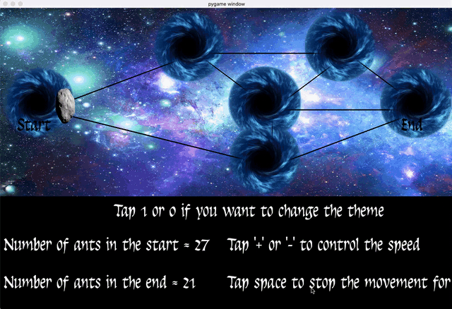

# Visualization_lemin
This project is visialisation written in language `python` for lem_in 42.
## About project
This program reads a map processed by a lem_in and reproduces the movement of ants.
Eximple of map:


Output from lem_in (with ants movement map):


## Installation and usage
```
git clone https://github.com/pechenovadasha/visualization_lemin.git
```
```
python3 -m pip install -U pygame==2.0.0.dev6 --user
```
```
cd direct and run python3 visual.py <lem-in> <map>
```
## The scene



## Keys 
`You can:`

1)See `number` of ants in `the first and the end room` in the menu.

2)Change `theme` whith '1' and '0'.

3)Change `speed` of ants with '+' and '-'.

4)`Stop` ants for a few second.
